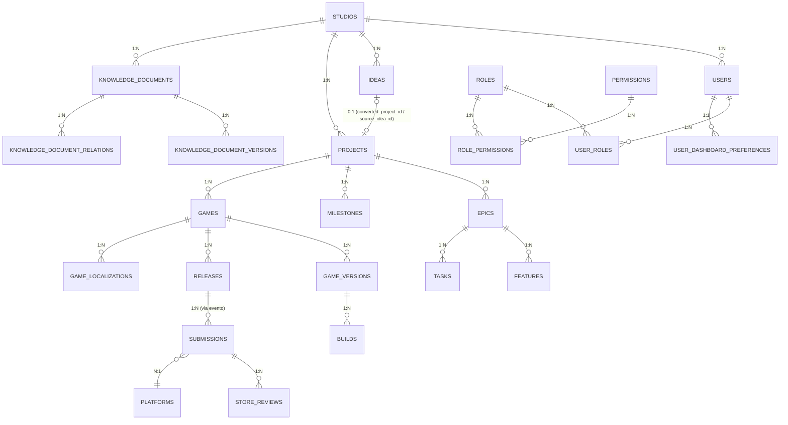

# DATA_MODEL.md

Auditoria da arquitetura de dados do AI Game Studio OS — modelo ER revisado, antes de qualquer implementação de Supabase.

**Este documento não implementa nada.** Não cria migrations, não cria `packages/database`, não conecta Supabase. É a arquitetura de dados proposta, para revisão, antes do Sprint 1.7 (Foundation for Supabase).

Como `VISION.md`/`DEFINITION_OF_DONE.md`/`ADR-005`, é autorado pelo projeto — não faz parte do lote frozen, mas deriva estritamente do que já está congelado em `docs/frozen/` (`AGSOS-SPEC-002` Domain Blueprint, `AGSOS-SPEC-003` Data Architecture, `AGSOS-SPEC-007` Business Features, `UL-001` Ubiquitous Language, `ADR-003`). Onde este documento propõe algo, é porque o frozen deixou em aberto (ex.: colunas específicas de `projects`/`games`/`submissions`) — nunca contradiz o frozen.

---

## 1. Correção crítica antes de prosseguir

A sugestão original de tabelas incluía `organizations` e `memberships`. **Esses termos não existem em `UL-001`.** O vocabulário oficial já resolve multi-tenancy com um modelo mais simples:

- **Studio** — organização proprietária (raiz de tudo, um Studio possui um Workspace lógico).
- **User** — pessoa autenticada; per `AGSOS-SPEC-002` §13, "Todo usuário pertence a um Studio" (relação direta, não via tabela de membership separada).
- **Role**/**Permission** — atribuídas ao User dentro do Studio (`AGSOS-SPEC-002` §13: "Toda Role possui Permissions").

Não existe hoje, no domínio congelado, o conceito de um usuário pertencer a **múltiplos** Studios (o que uma tabela `memberships` sugeriria). `VISION.md` deixa em aberto se o produto um dia atende múltiplos estúdios (multi-tenant SaaS) — mas isso é uma decisão de produto ainda não tomada, não algo para antecipar na modelagem agora. Se/quando isso mudar, é uma mudança de modelo que exige ADR próprio (moveria de `users.studio_id` direto para uma tabela de associação N:N) — não vale pagar essa complexidade antes de ter certeza que será necessária.

**Proposta:** `studios`, `users` (com `studio_id` direto), `roles`, `permissions`, `role_permissions`, `user_roles`. Sem `organizations`/`memberships`.

---

## 2. Convenções já fixadas (não repetidas por tabela abaixo)

Todas de `AGSOS-SPEC-003` §2–3 — aplicam-se a **toda** tabela de negócio listada neste documento, mesmo quando não repetidas explicitamente:

```sql
id                   UUID PRIMARY KEY DEFAULT gen_random_uuid()  -- v7 se disponível
studio_id            UUID NOT NULL REFERENCES studios(id)
created_at           TIMESTAMPTZ NOT NULL DEFAULT NOW()
created_actor_type   actor_type NOT NULL
created_actor_id     UUID NULL
updated_at           TIMESTAMPTZ NOT NULL DEFAULT NOW()
updated_actor_type   actor_type NOT NULL
updated_actor_id     UUID NULL
archived_at          TIMESTAMPTZ NULL
archived_actor_type  actor_type NULL
archived_actor_id    UUID NULL
```

Exceções explícitas no frozen: `ledger_entries` (append-only, sem `archived_*`), `studio_events` (Event Store, sem `archived_*`, sem `updated_*`), tabelas globais em §10 (sem `studio_id`).

Convenção de nomes: tabelas `snake_case` plural, FKs `entidade_id`, índices `idx_tabela_coluna`, constraints `chk_`/`fk_`/`uq_`.

---

## 3. Diagrama ER (domínios em escopo: Studio, Administration/Auth, Projects, Games, Knowledge, Publishing)



---

## 4. Tabelas por domínio

### 4.1 Studio (raiz)

```sql
studios (
  -- colunas padrão (§2), exceto studio_id (é a própria raiz)
  id, created_at, created_actor_type, created_actor_id,
  updated_at, updated_actor_type, updated_actor_id,
  archived_at, archived_actor_type, archived_actor_id,
  name              TEXT NOT NULL,
  logo_url          TEXT NULL,
  color_palette     JSONB NULL,       -- StudioName/Logo/ColorPalette são Value Objects (SPEC-002 §4)
  timezone          TEXT NOT NULL DEFAULT 'UTC',
  currency          TEXT NOT NULL DEFAULT 'USD',
  locale            TEXT NOT NULL DEFAULT 'pt-BR',
  active_environment_id UUID NULL REFERENCES environments(id),
  owner_user_id     UUID NOT NULL REFERENCES users(id)  -- "Um Studio possui exatamente um Owner"
)
```

**Nota:** `owner_user_id` → `users(id)` cria uma referência circular com `users.studio_id` → `studios(id)` (todo User pertence a um Studio, e um Studio tem um Owner que é um User). Requer **FK adiável** (`DEFERRABLE INITIALLY DEFERRED`) na migration, mesmo padrão já previsto para `ideas.converted_project_id`/`projects.source_idea_id` (`AGSOS-SPEC-003` §7).

### 4.2 Administration / Auth

```sql
users (
  -- colunas padrão (§2)
  id                UUID PRIMARY KEY,  -- mesmo id do Supabase Auth (auth.users), não gen_random_uuid()
  email             TEXT NOT NULL UNIQUE,
  name              TEXT NOT NULL,
  avatar_url        TEXT NULL
)

roles (
  id, studio_id, ...(padrão),
  name              TEXT NOT NULL,   -- Owner, Admin, Developer, Viewer, Editor, Manager (por módulo, SPEC-007)
  description       TEXT NULL
)

permissions (
  id, ...(sem studio_id — tabela de catálogo, ver nota abaixo),
  key               TEXT NOT NULL UNIQUE,  -- ex.: "projects.create", "publishing.approve"
  description       TEXT NULL
)

role_permissions (
  id, studio_id,
  role_id           UUID NOT NULL REFERENCES roles(id),
  permission_id     UUID NOT NULL REFERENCES permissions(id),
  UNIQUE (role_id, permission_id)
)

user_roles (
  id, studio_id,
  user_id           UUID NOT NULL REFERENCES users(id),
  role_id           UUID NOT NULL REFERENCES roles(id),
  UNIQUE (user_id, role_id)
)
```

**Ponto em aberto (marcar para decisão, não decidir aqui):** `permissions` é um catálogo fixo de capacidades do sistema (não varia por Studio) — candidata a tabela global (`AGSOS-SPEC-003` §10), sem `studio_id`. Mas `roles` varia por Studio (cada Studio pode ter suas próprias Roles nomeadas). Confirmar esse split antes da migration.

`users.id` deve ser **o mesmo UUID** de `auth.users` do Supabase Auth (não um novo `gen_random_uuid()`) — é o padrão Supabase de "tabela de perfil" 1:1 com `auth.users`, populada via trigger `on_auth_user_created`.

### 4.3 Projects

```sql
ideas (
  -- padrão (§2)
  title             TEXT NOT NULL,
  description       TEXT NULL,
  status            idea_status NOT NULL DEFAULT 'CAPTURED',
  converted_project_id UUID NULL REFERENCES projects(id) DEFERRABLE INITIALLY DEFERRED
)

projects (
  -- padrão (§2)
  name              TEXT NOT NULL,
  description       TEXT NULL,
  status            project_status NOT NULL DEFAULT 'DRAFT',
  source_idea_id    UUID NULL REFERENCES ideas(id) DEFERRABLE INITIALLY DEFERRED,
  progress          SMALLINT NOT NULL DEFAULT 0 CHECK (progress BETWEEN 0 AND 100)
    -- campo derivado hoje no mock (ProjectCard mostra %); decidir se fica
    -- persistido (denormalizado, recalculado por trigger/job) ou 100%
    -- calculado em query a partir de epics/tasks concluídas — ver §7 Riscos.
)

epics (
  -- padrão (§2)
  project_id        UUID NOT NULL REFERENCES projects(id),
  title             TEXT NOT NULL,
  description       TEXT NULL,
  status            task_status NOT NULL DEFAULT 'NOT_STARTED'
)

features (
  -- padrão (§2)
  epic_id           UUID NOT NULL REFERENCES epics(id),
  title             TEXT NOT NULL,
  description       TEXT NULL,
  status            task_status NOT NULL DEFAULT 'NOT_STARTED'
)

tasks (
  -- padrão (§2)
  epic_id           UUID NOT NULL REFERENCES epics(id),
  feature_id        UUID NULL REFERENCES features(id),
  title             TEXT NOT NULL,
  status            task_status NOT NULL DEFAULT 'NOT_STARTED',
  priority           task_priority NOT NULL DEFAULT 'MEDIUM',
  due_date          DATE NULL,
  estimate          NUMERIC NULL  -- Effort/Estimate são Value Objects (SPEC-002 §5); unidade a definir (horas? story points?)
)

milestones (
  -- padrão (§2)
  project_id        UUID NOT NULL REFERENCES projects(id),
  title             TEXT NOT NULL,
  due_date          DATE NULL,
  completed_at      TIMESTAMPTZ NULL
)
```

**ENUMs usados:** `idea_status`, `project_status`, `task_status`, `task_priority` — todos já definidos em `AGSOS-SPEC-003` §13, nenhum novo necessário.

### 4.4 Games

```sql
games (
  -- padrão (§2)
  project_id        UUID NOT NULL REFERENCES projects(id),
  name              TEXT NOT NULL,
  description       TEXT NULL,
  status            game_status NOT NULL DEFAULT 'DRAFT',
  bundle_identifier TEXT NULL,   -- BundleIdentifier (iOS)
  package_name      TEXT NULL    -- PackageName (Android)
)

game_versions (
  -- padrão (§2)
  game_id           UUID NOT NULL REFERENCES games(id),
  version_number    TEXT NOT NULL,  -- VersionNumber, ex.: "1.2.0"
  status            version_status NOT NULL DEFAULT 'DRAFT'
)

builds (
  -- padrão (§2)
  game_version_id   UUID NOT NULL REFERENCES game_versions(id),
  status            build_status NOT NULL DEFAULT 'PENDING',
  platform_id       UUID NOT NULL REFERENCES platforms(id),
  artifact_url      TEXT NULL,
  logs_url          TEXT NULL
)

releases (
  -- padrão (§2)
  game_id           UUID NOT NULL REFERENCES games(id),
  game_version_id   UUID NOT NULL REFERENCES game_versions(id),
  status            release_status NOT NULL DEFAULT 'DRAFT'
)

game_localizations (
  -- já especificado literalmente em AGSOS-SPEC-003 §12
  id, studio_id, game_id, language_code,
  title, short_description, full_description,
  keywords, metadata
)
```

**Nota de fronteira (SPEC-002 §6):** Games é owner dos metadados (nome, descrição, ícone, categorias) — `game_localizations` cobre isso. Marketing (fora do escopo deste documento) é owner de `keywords`/estratégia ASO; o campo `keywords` em `game_localizations` é o metadado bruto exibido na loja, não a estratégia de keywords do Marketing (tabela `keywords` própria do domínio Marketing, não modelada aqui).

### 4.5 Publishing

```sql
submissions (
  -- padrão (§2)
  release_id        UUID NOT NULL REFERENCES releases(id),
  platform_id       UUID NOT NULL REFERENCES platforms(id),
  build_id          UUID NOT NULL REFERENCES builds(id),  -- "Nenhuma Submission sem Build válido"
  status            submission_status NOT NULL DEFAULT 'DRAFT'
)

store_reviews (
  -- padrão (§2)
  submission_id     UUID NOT NULL REFERENCES submissions(id),
  reviewer_notes    TEXT NULL,
  decision          submission_status NULL,  -- reaproveita o enum, ou considerar enum próprio se divergir
  reviewed_at       TIMESTAMPTZ NULL
)

certificates (
  -- padrão (§2)
  platform_id       UUID NOT NULL REFERENCES platforms(id),
  name              TEXT NOT NULL,
  expires_at        TIMESTAMPTZ NULL
)

provision_profiles (
  -- padrão (§2)
  platform_id       UUID NOT NULL REFERENCES platforms(id),
  certificate_id    UUID NOT NULL REFERENCES certificates(id),
  name              TEXT NOT NULL,
  expires_at        TIMESTAMPTZ NULL
)

store_connections (
  -- padrão (§2)
  platform_id       UUID NOT NULL REFERENCES platforms(id),
  status            integration_status NOT NULL DEFAULT 'DISCONNECTED',
  credentials_ref   TEXT NULL  -- referência a Supabase Secrets, nunca a credencial em si (SPEC-004 §13)
)
```

**Regra de fronteira crítica (SPEC-002 §8, já validada no mock do Sprint 1.5):** Publishing nunca lê `games`/`releases` diretamente por FK de aplicação fora do necessário — o fluxo real é `ReleaseReadyForSubmission` (evento) → `CreateSubmission` (Command). A FK `submissions.release_id` existe para integridade referencial no banco (RLS/joins), mas a **criação** de uma Submission não deve ser feita por uma feature de Publishing consultando o módulo Games diretamente em código — só via handler do evento.

### 4.6 Knowledge

Já inteiramente especificado em `AGSOS-SPEC-003` §9 — reproduzido aqui só para completude do diagrama:

```sql
knowledge_documents (
  -- padrão (§2)
  title             TEXT NOT NULL,
  type              knowledge_document_type NOT NULL,
  status            knowledge_document_status NOT NULL DEFAULT 'DRAFT'
)

knowledge_document_versions (
  -- padrão (§2), imutável após criada
  document_id       UUID NOT NULL REFERENCES knowledge_documents(id),
  version_number    INT NOT NULL,
  content           TEXT NOT NULL,
  summary           TEXT NULL
)

knowledge_document_relations (
  -- padrão (§2)
  document_id       UUID NOT NULL REFERENCES knowledge_documents(id),
  related_type      TEXT NOT NULL,  -- "project" | "game" | "idea" | "task" (polimórfico, sem FK — mesmo padrão do actor_id)
  related_id        UUID NOT NULL
)
```

### 4.7 Tabelas globais (sem `studio_id`, somente leitura, seed versionado)

```sql
platforms (id, name, kind)              -- App Store, Google Play, Steam...
countries (id, code, name)
languages (id, code, name)
currencies (id, code, symbol)
timezones (id, name)
notification_channel_definitions (id, type, name)
build_targets (id, platform_id, name)
```

### 4.8 Preferências e Event Store (transversais)

```sql
user_dashboard_preferences (
  -- já especificado em AGSOS-SPEC-003 §11
  id, user_id, studio_id,
  layout JSONB, widgets JSONB, collapsed_panels JSONB,
  favorite_widgets JSONB, updated_at
)

studio_events (
  -- Event Store, já especificado em AGSOS-SPEC-003 §5 — append-only, fonte
  -- única de auditoria (não criar audit_logs separado)
  id, event_name, event_version, aggregate_type, aggregate_id,
  studio_id, payload, metadata, occurred_at, actor_type, actor_id
)
```

---

## 5. Índices recomendados

Além de `idx_tabela_coluna` para toda FK (padrão), atenção especial a:

```sql
-- Toda tabela de negócio: RLS filtra por studio_id em toda query
CREATE INDEX idx_<tabela>_studio_id ON <tabela>(studio_id);

-- Consultas de listagem por status (list pages: /projects, /games, /knowledge, /publishing)
CREATE INDEX idx_projects_studio_status ON projects(studio_id, status) WHERE archived_at IS NULL;
CREATE INDEX idx_games_studio_status ON games(studio_id, status) WHERE archived_at IS NULL;
CREATE INDEX idx_submissions_studio_status ON submissions(studio_id, status) WHERE archived_at IS NULL;

-- studio_events cresce indefinidamente (append-only) — índice composto é essencial
CREATE INDEX idx_studio_events_studio_occurred ON studio_events(studio_id, occurred_at DESC);
CREATE INDEX idx_studio_events_aggregate ON studio_events(aggregate_type, aggregate_id);

-- Busca full-text (Fase 1, SPEC-003 §11)
CREATE INDEX idx_knowledge_documents_search ON knowledge_documents USING GIN (to_tsvector('portuguese', title));
```

---

## 6. RLS — padrão e casos especiais

**Padrão (toda tabela de negócio):**

```sql
ALTER TABLE <tabela> ENABLE ROW LEVEL SECURITY;

CREATE POLICY <tabela>_isolation ON <tabela>
  USING (studio_id = (SELECT studio_id FROM users WHERE id = auth.uid()));
```

**Casos especiais:**

| Tabela | Particularidade |
|---|---|
| `studios` | Política própria: usuário só vê o Studio ao qual pertence (`id = current_user_studio`), não filtra por `studio_id` (é a própria raiz) |
| `permissions` (se global) | Sem RLS — leitura pública autenticada, sem filtro de `studio_id` |
| `platforms`/`countries`/etc. (globais) | Sem RLS — leitura pública, somente admin escreve |
| `ledger_entries` | RLS de isolamento **+** política que bloqueia `UPDATE`/`DELETE` para todos os roles exceto `service_role` (trigger de proteção, `ADR-003`) |
| `studio_events` | RLS de isolamento **+** mesma proteção contra `UPDATE`/`DELETE` |
| `knowledge_document_versions` | Imutável após criada — só `INSERT`, nunca `UPDATE` |

**Testes obrigatórios por tabela** (já exigido em `AGSOS-SPEC-003` §4): usuário sem auth, usuário autenticado do Studio dono, usuário autenticado de outro Studio, admin (bypass via `admin-client`), membro comum. Nenhuma tabela deste documento deve ir para produção sem esses 5 cenários testados em `supabase/tests/`.

---

## 7. Mapeamento mock → real (referência para o Sprint 1.7+)

| Store mock atual | Campo mock | Tabela real | Campo real |
|---|---|---|---|
| `auth-store.ts` | `{ name, email }` (localStorage) | `auth.users` (Supabase) + `users` (profile) | `email`, `name` |
| `projects-store.ts` | `status: "Em desenvolvimento"` etc. | `projects.status` | mapear para `project_status` (`DRAFT`\|`PLANNING`\|`ACTIVE`\|...) — **os rótulos em português do mock não são os valores do ENUM**, só a label exibida; precisa de camada de tradução na UI |
| `projects-store.ts` | `progress: number` | `projects.progress` OU calculado | decidir conforme §4.3 |
| `games-store.ts` | `platforms: string[]` | `builds.platform_id` (join com `platforms`) | mock tem platforms no Game; real tem no Build — Game não tem coluna `platforms` própria, é derivado das plataformas dos seus Builds/Releases |
| `games-store.ts` | `builds: [{ status, version, date }]` | `builds` + `game_versions` | `builds.status`, `game_versions.version_number`, `builds.created_at` |
| `knowledge-store.ts` | `type`, `status` (Rascunho/Publicado) | `knowledge_documents.type`/`status` | mapear para `knowledge_document_type`/`knowledge_document_status` (mock só tem 2 status, ENUM real tem 6) |
| `publishing-store.ts` | `history: [{status, date}]` | `store_reviews` (parcial) + `studio_events` | o "histórico" do mock é, no real, reconstruído a partir de `studio_events` filtrado por `aggregate_id = submission.id` — não uma coluna própria |

Esse mapeamento confirma o diagnóstico do usuário: a troca é majoritariamente mecânica, mas **três pontos exigem decisão de produto antes da migration** (marcados acima): unidade de `estimate`, se `progress` é persistido ou calculado, e se o "histórico" de status vira uma view sobre `studio_events` ou uma tabela própria mais simples (`submission_status_history`) — a segunda opção é mais barata de consultar, a primeira evita duplicar o Event Store. Recomendação: view sobre `studio_events`, para não duplicar fonte de verdade — mas registrar como decisão explícita no `DECISIONS.md` quando o Sprint 1.7 for executado, não aqui.

---

## 8. Riscos e pontos de atenção

1. **FKs circulares** (`studios.owner_user_id` ↔ `users.studio_id`; `ideas.converted_project_id` ↔ `projects.source_idea_id`) exigem `DEFERRABLE INITIALLY DEFERRED` e uma ordem de INSERT cuidadosa na migration/seed — testar explicitamente.
2. **`permissions` como tabela global vs. por-Studio** — decidir antes da migration; muda se tem `studio_id` ou não.
3. **`progress` de Project** — persistido (risco: dessincroniza de epics/tasks reais) vs. calculado em query (risco: performance em listas grandes sem índice adequado). Ambos são aceitáveis; só não decidir por omissão.
4. **`studio_events` sem partição** — é append-only e cresce para sempre; sem estratégia de particionamento (por `studio_id` ou por mês de `occurred_at`), consultas de histórico degradam com o tempo. Não é urgente no Sprint 1.7 (poucos dados), mas vale registrar como débito técnico desde já.
5. **UUID v7** — `AGSOS-SPEC-003` §12 pede verificar suporte antes da primeira migration. Supabase (Postgres 15+) normalmente não tem `gen_random_uuid()` gerando v7 nativamente ainda — checar versão do Postgres do projeto Supabase assim que ele existir; fallback documentado é UUID v4 com ADR.
6. **`actor_id` sem FK polimórfica** — íntegro só por validação de aplicação + CHECK constraints, conforme já decidido em SPEC-003 §3. Isso significa que testes de RLS/integridade precisam cobrir esse caso especificamente (não é pego pelo banco sozinho).
7. **Multi-Studio por usuário** — hoje fora de escopo (ver §1). Se isso mudar no futuro, é uma migração de `users.studio_id` (coluna) para uma tabela de associação — vale registrar esse ponto de extensão aqui para quem revisitar o assunto.

---

## 9. Ordem recomendada de migrations (quando o Sprint 1.7 for executado)

1. ENUMs (todos os de `AGSOS-SPEC-003` §13)
2. Tabelas globais (§4.7) + seed
3. `studios`, `users` (com FK adiável entre eles)
4. `roles`, `permissions`, `role_permissions`, `user_roles`
5. `ideas`, `projects` (com FK adiável entre eles), `epics`, `features`, `tasks`, `milestones`
6. `games`, `game_versions`, `builds`, `releases`, `game_localizations`
7. `submissions`, `store_reviews`, `certificates`, `provision_profiles`, `store_connections`
8. `knowledge_documents`, `knowledge_document_versions`, `knowledge_document_relations`
9. `studio_events`, `user_dashboard_preferences`
10. Políticas RLS (uma migration por tabela ou agrupada por domínio — decidir no momento, "uma migration = um contexto de negócio")
11. Seeds de desenvolvimento (dados equivalentes aos seeds mock atuais, para não perder os dados de demonstração já usados nos screenshots)

---

## 10. O que este documento não decide (fora de escopo)

- Marketing, Analytics, Finance — schemas mencionados em `AGSOS-SPEC-002`/`007`, mas fora do Sprint 1.7–2.2 conforme o roadmap atual; auditar quando esses módulos entrarem em pauta.
- AI/Conversations/Prompts (domínio Artificial Intelligence) — idem.
- Infrastructure (Environment/Deployment/Webhook/Notification) — idem, exceto o que já foi citado (`active_environment_id` em `studios`).
- Repository pattern concreto (`packages/database/src/repositories/`) — a estrutura de pastas já está definida em `ADR-003`; o conteúdo de cada repository é implementação, não arquitetura de dados.

---

## Conclusão

O modelo de domínio já congelado (`SPEC-002`, `SPEC-003`) cobre a grande maioria das decisões estruturais — esta auditoria não encontrou necessidade de propor nada que contradiga o frozen, só de **completar** o que ficou implícito (colunas específicas por tabela, índices, mapeamento mock→real) e de **corrigir** uma divergência de nomenclatura (`organizations`/`memberships` → `studios`/`users` direto). Os 7 pontos da seção 8 são as únicas decisões reais pendentes antes de escrever a primeira migration.
